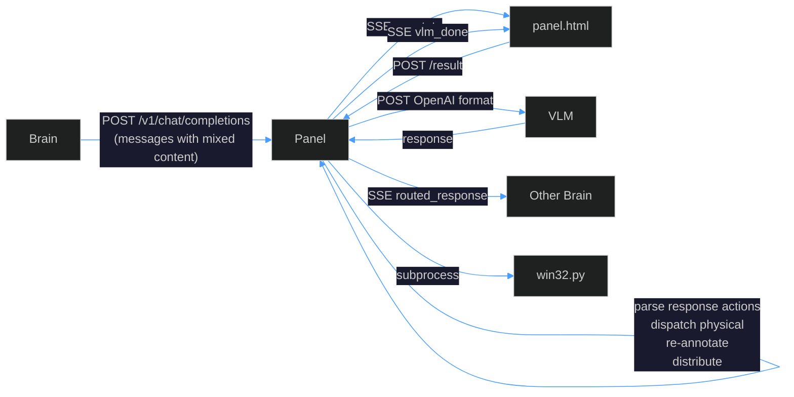
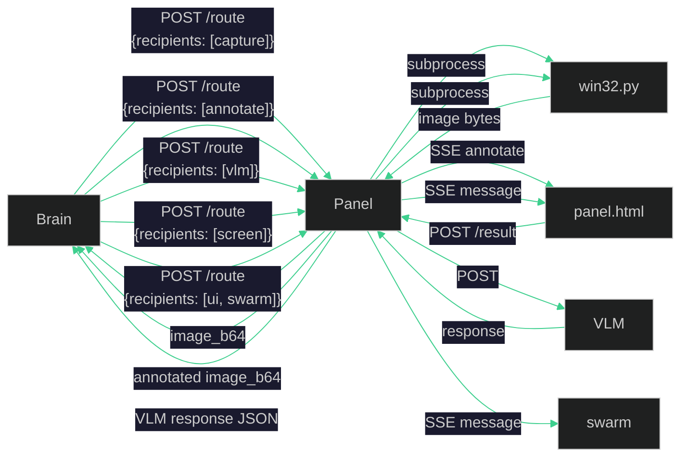
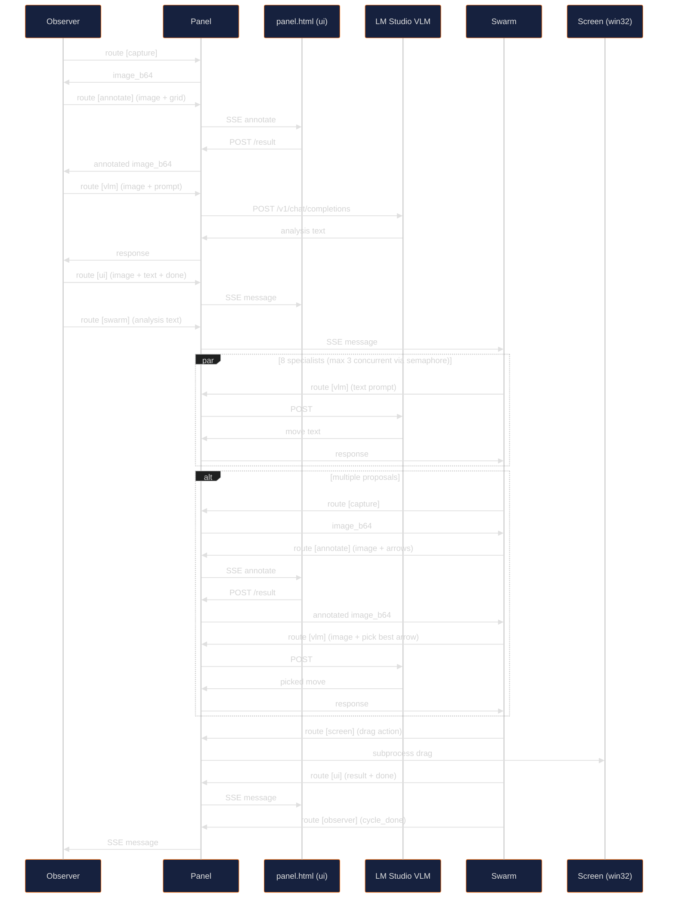

# Panel — Dumb Router for VLM Brain Swarms

A minimal routing infrastructure for orchestrating vision-language model (VLM) agents that observe, reason about, and interact with a live screen. Panel is **pure plumbing** — it routes messages between brains, services, and a UI with zero domain knowledge.

## Architecture

### Before: Monolithic Pipeline

The original `panel.py` was an intelligent middleware — it inspected message content, inferred intent, captured screens, annotated images, forwarded to VLM, parsed responses, dispatched actions, and distributed results. All in one 400-line HTTP handler.



**Problems:**
- Content inspection to guess intent (`has_forwardable` inference)
- Signal short-circuit was an emergent side-effect, not a declared concept
- Brains sending text accidentally defeated the short-circuit, causing wasted VLM calls
- Fixed pipeline order baked into panel — brains could not customize the sequence
- Action dispatch, overlay collection, image swapping all entangled in one function
- 38-line `_process_content_parts` + 24-line `_process_response_actions` + 80-line monolithic handler
- UI was hardcoded to `annotate` and `vlm_done` event types
- Two separate SSE systems (`/events` for UI, `/agent-events` for brains)

### After: Pure Message Router



**Panel does exactly one thing:** read `recipients`, deliver to each. No content inspection. No intent inference. No pipeline orchestration.

### Full System Architecture

```mermaid
%%{init: {'theme': 'dark', 'themeVariables': {'primaryColor': '#1a1a2e', 'primaryTextColor': '#e0e0e0', 'primaryBorderColor': '#c084fc', 'lineColor': '#c084fc', 'secondaryColor': '#16213e', 'tertiaryColor': '#0f3460', 'edgeLabelBackground': '#1a1a2e', 'clusterBkg': '#16213e', 'clusterBorder': '#c084fc', 'nodeTextColor': '#e0e0e0'}}}%%
flowchart TB
    subgraph External["External Services"]
        LMS["LM Studio<br/>127.0.0.1:1235<br/>qwen3.5-0.8b VLM"]
        Screen["Windows 11 Screen"]
        Chess["Chess Application"]
    end

    subgraph Panel["Panel Router — 127.0.0.1:1236"]
        Router["panel.py<br/>POST /route<br/>GET /agent-events<br/>POST /result"]
        Logger["panel.txt<br/>Transport Logs"]
    end

    subgraph Brains["Brain Processes"]
        Observer["observer.py<br/>VLMConfig: max_tokens=500<br/>Capture → Annotate → VLM → Distribute"]
        Swarm["swarm.py<br/>8 Specialists + Executor<br/>Semaphore(3) throttle"]
    end

    subgraph SwarmDetail["Swarm Internals"]
        direction TB
        S1["pawn specialist"]
        S2["knight specialist"]
        S3["bishop specialist"]
        S4["rook specialist"]
        S5["queen specialist"]
        S6["king specialist"]
        S7["tactics specialist"]
        S8["positional specialist"]
        Exec["executor<br/>VLMConfig: max_tokens=170"]
    end

    subgraph UI["Browser UI"]
        HTML["panel.html<br/>Chrome 1080p<br/>SSE listener<br/>OffscreenCanvas annotator"]
    end

    subgraph Shared["Shared Module"]
        BU["brain_util.py<br/>VLMConfig dataclass<br/>All hyperparameters<br/>Route helpers"]
    end

    subgraph Win32["Win32 Automation"]
        W32["win32.py<br/>capture / drag / click<br/>type_text / press_key / hotkey<br/>scroll / select_region"]
    end

    Observer -->|"POST /route → [capture]"| Router
    Router -->|"subprocess"| W32
    W32 -->|"screenshot bytes"| Screen
    Screen -->|"pixels"| Chess

    Observer -->|"POST /route → [annotate]"| Router
    Router -->|"SSE annotate"| HTML
    HTML -->|"POST /result (annotated b64)"| Router

    Observer -->|"POST /route → [vlm]"| Router
    Router -->|"POST /v1/chat/completions"| LMS

    Observer -->|"POST /route → [swarm]"| Router
    Router -->|"SSE message"| Swarm

    Swarm -->|"8x POST /route → [vlm]<br/>throttled by Semaphore(3)"| Router
    S1 & S2 & S3 & S4 & S5 & S6 & S7 & S8 -->|"proposals"| Exec

    Swarm -->|"POST /route → [screen] (drag)"| Router
    Router -->|"subprocess drag"| W32

    Swarm -->|"POST /route → [observer]<br/>cycle_done signal"| Router
    Router -->|"SSE message"| Observer

    Observer & Swarm -->|"POST /route → [ui]"| Router
    Router -->|"SSE message"| HTML

    Router -->|"append"| Logger

    Observer -.->|"import"| BU
    Swarm -.->|"import"| BU
```



### Chess Brain Cycle Flow



## Components

| File | Role | Touches content? |
|---|---|---|
| `panel.py` | Message router + transport logger | **No** — reads only `agent` and `recipients` for routing. Logs full request/response bodies as opaque blobs. |
| `panel.html` | UI display + annotation service | Renders what brains push to it |
| `win32.py` | Screen capture + input automation | Unchanged CLI tool |
| `brain_util.py` | Brain-side routing helpers + `VLMConfig` | Single source of truth for model name and all hyperparameters |
| `observer.py` | Board analysis brain | Captures, annotates, VLM, distributes |
| `swarm.py` | Move selection brain | 8 specialists (throttled), executor, drag |

## Recipient Types

| Recipient | Transport | Behavior |
|---|---|---|
| `capture` | Sync — subprocess | Returns `{image_b64}` |
| `annotate` | Sync — Chrome round-trip | Returns `{image_b64}` |
| `vlm` | Sync — HTTP POST | Returns VLM response JSON |
| `screen` | Sync — subprocess | Executes actions, returns `{ok}` |
| Any other string | Async — SSE push | Fire-and-forget to `/agent-events?agent=<name>` |

**Rule:** At most one sync recipient per request. Any number of async recipients.

## VLMConfig — Centralized Hyperparameters

All LLM hyperparameters are defined once in `brain_util.VLMConfig`:

| Field | Default | Source |
|---|---|---|
| `model` | `qwen3.5-0.8b` | Single model for all agents |
| `temperature` | `0.7` | Qwen3.5 documentation |
| `max_tokens` | `200` | Per-agent override |
| `top_p` | `0.8` | Qwen3.5 documentation |
| `top_k` | `20` | Qwen3.5 documentation |
| `min_p` | `0.0` | Qwen3.5 documentation |
| `presence_penalty` | `1.5` | Qwen3.5 documentation |
| `frequency_penalty` | `0.0` | Default |
| `repeat_penalty` | `1.0` | Qwen3.5 documentation |
| `stream` | `False` | Explicit non-streaming |
| `stop` | `None` | Optional |
| `seed` | `None` | Optional (reproducibility) |
| `logit_bias` | `None` | Optional |

Brains override only what they need:
```python
OBSERVER_VLM: bu.VLMConfig = bu.VLMConfig(max_tokens=500)
SPECIALIST_VLM: bu.VLMConfig = bu.VLMConfig(max_tokens=220)
EXECUTOR_VLM: bu.VLMConfig = bu.VLMConfig(max_tokens=170)
```

## Protocol

### Route Request

```
POST /route
Content-Type: application/json

{
  "agent": "observer",
  "recipients": ["capture"],
  "region": "100,100,900,900",
  "capture_size": [640, 640]
}
```

### Route Response

For sync recipients — the service result:
```json
{"request_id": "uuid", "image_b64": "..."}
```

For async-only — acknowledgment:
```json
{"request_id": "uuid", "ok": true}
```

### SSE Events

All agents (including `ui`) listen on:
```
GET /agent-events?agent=<name>
```

Event types:
- `connected` — SSE connection established
- `message` — brain-to-brain or brain-to-ui message
- `annotate` — annotation request (ui channel only, internal to annotate service)

### Annotation Flow

1. Brain sends `recipients: ["annotate"]` with `image_b64` + `overlays`
2. Panel pushes `annotate` event to `ui` agent channel
3. `panel.html` renders overlays on OffscreenCanvas
4. `panel.html` POSTs result to `/result` with `{request_id, image_b64}`
5. Panel unblocks and returns annotated image to brain

### UI Protocol

Brains push to `recipients: ["ui"]` with optional fields:

| Field | Effect |
|---|---|
| `event_type` | `pending` / `done` / `error` / any custom string |
| `text` | Displayed in text pane |
| `image_b64` | Displayed in image pane |
| `status` | Displayed next to agent pill |
| `error` | If truthy, chip shows red dot |

## Transport Logging

Panel logs full VLM request and response bodies to `panel.txt` as opaque blobs:

| Log Event | Content |
|---|---|
| `vlm_forward` | Full `vlm_request` dict including messages, hyperparameters, image base64 |
| `vlm_response` | Full VLM response dict including choices, usage |
| `vlm_error` | HTTP status code + full error response body |

All other route types (capture, annotate, screen, async push) logged with metadata only. Base64 content in logs can be replaced externally with a simple script.

## What Changed — Quantified

| Metric | Before | After |
|---|---|---|
| `panel.py` routing logic | ~200 lines of pipeline/inference | ~30 lines of routing |
| Content inspection functions | 2 (`_process_content_parts`, `_process_response_actions`) | 0 |
| `has_forwardable` inference | Yes — scanned every message part | Deleted |
| Signal mechanism | Emergent side-effect | Not needed — brain-to-brain messaging is native |
| SSE systems | 2 (`/events` + `/agent-events`) | 1 (`/agent-events` for all) |
| UI event types hardcoded | `annotate`, `vlm_done` | Generic `message` — brain controls display |
| Pipeline order | Fixed in panel | Brain-controlled — any sequence of route calls |
| `_envelope` builder | 12-parameter function | Deleted — body IS the envelope |
| Brain-to-brain communication | Hack via fake VLM prompts | First-class `recipients: ["agent_name"]` |
| Model names | Scattered across files (`qwen3.5-vl`, `qwen3.5-0.8b`) | Single `VLMConfig.model` default |
| Hyperparameters | `temperature` + `max_tokens` only | All 12 LM Studio API parameters |
| Specialist prompts | 8 near-identical multi-line strings | Template `_PIECE_PROMPT.format()` + 2 distinct |
| Concurrent VLM requests | Unlimited (8 simultaneous) | `Semaphore(3)` throttle |
| VLM error diagnostics | `"HTTP Error 400: Bad Request"` | Full response body captured and logged |
| VLM transport logging | None | Full request + response bodies logged |

## LM Studio Configuration

| Setting | Required Value |
|---|---|
| Model | `qwen3.5-0.8b` (multimodal VLM) |
| Server port | `1235` |
| Auto unload model | **OFF** |
| Keep model in memory | **Always** |
| Parallel request slots | 3 (matches `Semaphore(3)`) |

---

## Claude Opus 4.6 Review Prompt

The following prompt is designed for a fresh chat with no prior history. It enables full code review, log analysis, and modification of any single component independently.

````
You are reviewing and maintaining a Python 3.13 + Windows 11 + Chrome project called "Panel" — a dumb message router for VLM brain swarms. Your role is to perform logical review, code review, log analysis, and produce modifications when asked. You work with one file at a time.

SYSTEM OVERVIEW:

Panel is a multi-process system where independent "brain" scripts orchestrate screen observation, LLM reasoning, and physical input automation through a central HTTP router that has ZERO domain knowledge.

COMPONENTS (6 files):

1. panel.py — ThreadingHTTPServer on 127.0.0.1:1236. Routes messages based ONLY on the "recipients" field. Four sync recipients: "capture" (subprocess to win32.py, returns image_b64), "annotate" (SSE round-trip through Chrome panel.html, returns annotated image_b64), "vlm" (HTTP POST to LM Studio on 127.0.0.1:1235, returns full response JSON), "screen" (subprocess to win32.py for mouse/keyboard actions). Any other recipient name is async SSE push to /agent-events?agent=<name>. Rule: at most one sync recipient per request. Panel logs everything to panel.txt via Python logging. VLM requests and responses are logged as full raw dicts (including base64 image data). Panel never inspects, modifies, or makes decisions based on message content. It reads only "agent" and "recipients" fields for routing. Launched as: python panel.py brain1.py brain2.py — it starts the HTTP server, then spawns each brain as a subprocess with --region and --scale args.

2. brain_util.py — Shared module imported by all brains. Contains: VLMConfig frozen dataclass (model="qwen3.5-0.8b", temperature=0.7, top_p=0.8, top_k=20, min_p=0.0, presence_penalty=1.5, frequency_penalty=0.0, repeat_penalty=1.0, stream=False, plus optional stop/seed/logit_bias). All None-valued fields excluded from request JSON. Contains route() helper that POSTs to panel /route endpoint with agent+recipients+payload. Contains capture(), annotate(), vlm(), vlm_text(), screen(), push(), ui_pending(), ui_done(), ui_error() convenience wrappers. Contains make_vlm_request(cfg, system_prompt, user_content) and make_vlm_request_with_image(cfg, system_prompt, image_b64, user_text) — both accept VLMConfig and emit all hyperparameters. Contains grid/arrow overlay builders and coordinate helpers. SENTINEL="NONE", NORM=1000 (normalized coordinate space).

3. observer.py — Brain process. Runs a loop: capture screen → annotate with 8x8 grid → send annotated image + prompt to VLM → push analysis text + image to UI and to swarm agent → wait for "cycle_done" SSE signal from swarm. Uses OBSERVER_VLM = VLMConfig(max_tokens=500). SSE listener on /agent-events?agent=observer. Sequential — one VLM call per cycle.

4. swarm.py — Brain process. Receives observer analysis via SSE. Spawns 8 specialist threads (pawn/knight/bishop/rook/queen/king/tactics/positional) that each call VLM with text-only prompts asking for the best move of their piece type. Uses threading.Semaphore(3) to throttle concurrent VLM calls to match LM Studio's 3 parallel slots. 6 piece specialists share a template prompt via str.format(). Tactics and positional have distinct prompts. All prompts enforce strict output: "from to" or "NONE". After specialists finish, if multiple proposals exist, an executor captures screen, annotates with colored arrows per proposal, sends image to VLM to pick the best. Executor also throttled by the same semaphore. Winning move executed as a drag action via screen recipient. Signals observer cycle_done when finished. Uses SPECIALIST_VLM=VLMConfig(max_tokens=220) and EXECUTOR_VLM=VLMConfig(max_tokens=170).

5. panel.html — Single-page browser UI served at /. Connects to /agent-events?agent=ui via SSE. Displays agent status pills, text pane, image pane. Handles "annotate" events by rendering overlays on OffscreenCanvas and POSTing result back to /result. Dark cyber aesthetic. Independent dark theme (does not follow OS). Designed for 1080p 16:9 Chrome.

6. win32.py — CLI tool for Windows 11 screen automation. Subcommands: capture (screenshot region to stdout as raw bytes), select_region (interactive rubber-band selection), drag/click/double_click/right_click (mouse actions), type_text/press_key/hotkey (keyboard), scroll_up/scroll_down, cursor_pos. Takes --region as "x1,y1,x2,y2" string and --pos/--from_pos/--to_pos as normalized 0-1000 coordinates mapped onto the region.

PROTOCOL DETAILS:

All brain-to-panel communication is POST /route with JSON body containing "agent" (string), "recipients" (list of strings), plus any additional payload fields. Panel returns the sync recipient's result or {"ok":true} for async-only. Every request gets a UUID request_id assigned by panel.

Overlay format: {"type":"overlay","points":[[x,y],[x,y]],"closed":bool,"stroke":"color","stroke_width":int} where coordinates are in 0-1000 normalized space.

VLM requests follow OpenAI /v1/chat/completions format. Image content uses: {"type":"image_url","image_url":{"url":"data:image/png;base64,..."}}. Text content uses: {"type":"text","text":"..."}.

The model is Qwen3.5-0.8B — a small multimodal VLM. All prompts must be short, explicit, and format-enforcing. No chain-of-thought. The model can process both text and images.

LOG FORMAT (panel.txt):

Each line: YYYY-MM-DDTHH:MM:SS.mmm | event_name | key=value | key=value
Key events: route, vlm_forward (full request body), vlm_response (full response body), vlm_error (status + error body), capture_done, annotate_sent, annotate_received, annotate_timeout, action_dispatch, routed, sse_connect, sse_disconnect, brain_launched, server_handler_error, panel_js.
Base64 image data appears raw in vlm_forward/vlm_response logs — when analyzing, mentally skip or note its presence.

CODING RULES:

- Python 3.13 only. Modern syntax, strict typing with dataclasses and pattern matching. No legacy code.
- Windows 11 only. No cross-platform fallbacks.
- Latest Google Chrome only.
- Maximum code reduction. Remove every possible line while keeping 100% functionality.
- Perfect Pylance/pyright compatibility: full type hints, frozen dataclasses for all configuration.
- No comments anywhere in any file.
- No slicing or truncating of data anywhere. Python code must not impact data in any way.
- No functional magic values — all constants in frozen dataclasses.
- No duplicate flows. No hidden fallback behavior.
- HTML: latest HTML5, modern CSS (custom properties, grid/flex), modern JS. Dark cyber aesthetic, independent dark theme from OS. 1080p 16:9 Chrome target. No legacy support.
- Prompts as triple-quoted docstrings, never concatenated strings with \n.
- No code duplication. Shared code lives in brain_util.py.

WHEN RECEIVING A FILE FOR REVIEW:

1. Identify which component it is from the 6-file list above.
2. Check adherence to all coding rules.
3. Check protocol compliance (correct recipient names, correct payload structure, correct VLMConfig usage).
4. Check for dead code, duplication, unreachable branches, missing type hints.
5. If it is a brain file, verify it uses brain_util helpers and VLMConfig consistently.
6. If it is panel.py, verify it remains content-agnostic (routes only, no content inspection for decisions).
7. If it is panel.html, verify dark theme independence, 1080p layout, modern CSS/JS, SSE handling, annotation round-trip.

WHEN RECEIVING LOG DATA:

1. Parse the event timeline.
2. Identify the cycle boundaries (observer capture → vlm → swarm specialists → executor → drag → cycle_done).
3. Flag any vlm_error entries — read the status code and error body.
4. Flag any annotate_timeout entries.
5. Flag any server_handler_error entries.
6. Check for model name mismatches in vlm_forward logs.
7. Check for concurrent request patterns (multiple vlm_forward before corresponding vlm_response).
8. Measure cycle duration and identify bottlenecks.

WHEN RECEIVING HTML AS BASE64:

Decode the base64 string to get the HTML source. Review it as panel.html per the rules above.

WHEN ASKED TO MODIFY:

Produce the complete file. No partial patches. No diff format. The full file ready to save and run. Follow all coding rules. Ensure the file works independently with the rest of the system unchanged.

Always wait for the user to provide the file or log data. Do not assume or generate sample content. Ask which file or what data the user wants to work on if unclear.
````

---

*Generated after a productive refactoring session: unified model name across all brains, centralized VLMConfig with all LM Studio hyperparameters, deduplicated specialist prompts, added Semaphore(3) throttle for concurrent VLM requests, added full transport logging for VLM request/response bodies, fixed model name mismatch that caused LM Studio auto-unload and 400 errors.*